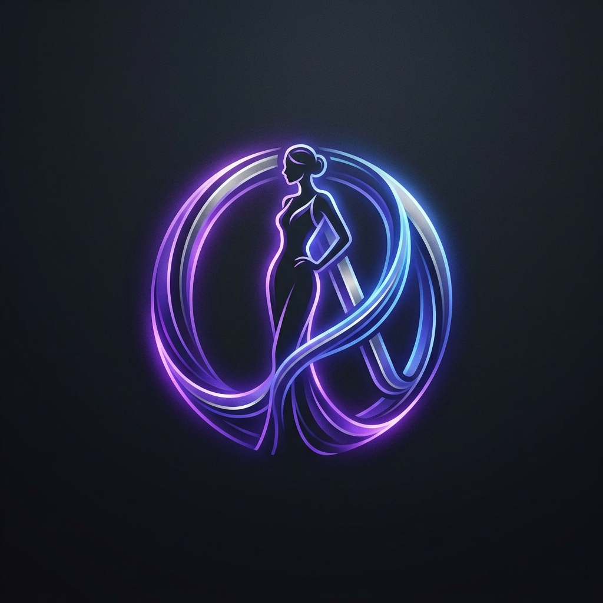

# 👗 OutfitAura: AI-Powered Virtual Try-On & Fashion Assistant

<p align="center">
  
</p>

**OutfitAura** is a premium, full-stack virtual try-on application that leverages state-of-the-art AI to help users visualize clothing on themselves. Built with a modern glassmorphic UI and a high-performance serverless GPU backbone, it provides a seamless and "magical" shopping experience.

---

## 🚀 Key Features

- **Virtual Try-On**: Powered by **CatVTON**, allowing users to see any garment on their own photo.
- **AI Human Parsing**: Uses **Segformer** for accurate clothing and body segmentation.
- **AI Fashion Advice**: Integrated with **Groq (Llama 3)** to provide personalized styling tips.
- **Serverless GPU Backend**: Leveraging **Modal** for scalable, on-demand GPU inference (A10G).
- **Modern UI/UX**: A stunning React frontend with glassmorphism, dark mode, and smooth animations.
- **Secure Authentication**: Firebase-powered login and signup.

---

## 🛠 Tech Stack

### Frontend
- **Framework**: React.js (Vite)
- **Styling**: Vanilla CSS (Custom Design System)
- **Auth**: Firebase Authentication
- **Deployment**: Vercel

### Backend
- **Framework**: FastAPI (Python)
- **AI Models**: CatVTON, Segformer-b2
- **GPU Infrastructure**: Modal (Serverless GPU)
- **LLM**: Groq (Llama 3)
- **Deployment**: Hugging Face Spaces (CPU Tier)

---

## 🏗 System Architecture

OutfitAura uses a cost-effective, high-performance hybrid architecture:
1.  **FastAPI Backend** (HF Spaces): Handles API requests, image uploads, and logic.
2.  **Modal GPU Worker**: A serverless function that spins up an NVIDIA A10G GPU only when a try-on request is made.
3.  **Local Fallback**: Includes a local CPU-based inference path for development.

---

## 📂 Project Structure

```text
OutfitAura/
├── frontend/           # React + Vite Application
│   ├── public/         # Static assets (Logo, etc.)
│   ├── src/            # Components, Hooks, Context
│   └── ...
└── backend/            # FastAPI Application
    ├── modal_app.py    # Cloud GPU Serverless Code
    ├── main.py         # Primary API Entry Point
    ├── tryon_service.py # Core Inference Logic
    ├── parsing_model/  # Segformer Weights (Local)
    ├── checkpoints/    # CatVTON Weights (Local)
    └── ...
```

---

## ⚙️ Local Setup

### 1. Backend Setup
```bash
cd backend
python -m venv venv
source venv/bin/activate  # On Windows: .\venv\Scripts\activate
pip install -r requirements.txt
```
Create a `.env` file in the `backend/` folder:
```env
GROQ_API_KEY=your_groq_key
MODAL_APP_NAME=outfitaura-backend
# For local dev without Modal
COLAB_TRYON_URL=
```

### 2. Frontend Setup
```bash
cd frontend
npm install
```
Create a `.env` file in the `frontend/` folder:
```env
VITE_API_BASE_URL=http://localhost:8000
VITE_FIREBASE_API_KEY=...
# Add your other Firebase config here
```

---

## ☁️ Deployment Guide

### Modal GPU (The Muscle)
1. Install Modal: `pip install modal`
2. Authenticate: `modal setup`
3. Deploy: `modal deploy modal_app.py`

### Hugging Face Space (The Brain)
1. Create a **Docker** Space on Hugging Face.
2. Set the following **Secrets**:
   - `MODAL_TOKEN_ID`
   - `MODAL_TOKEN_SECRET`
   - `GROQ_API_KEY`
   - `MODAL_APP_NAME`
3. Push the `backend/` code to the Space.

### Vercel (The Face)
1. Import the `frontend/` folder to Vercel.
2. Set `VITE_API_BASE_URL` to your Hugging Face Space URL.

---

## 📜 License
This project is part of a Final Year Project. All rights reserved.

---

<p align="center">
  Built with ❤️ by Artasam and Team
</p>
